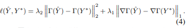

# **关于Burst Denoising with Kernel Prediction Network：**

## 1.该文章所说的所有贡献为：
### *A procedure for converting post-processed images taken from the internet into data with the characteristics of raw linear data captured by real cameras.
### *a network architecture that outperforms the state-of-art on synthetic and real data by predicting a unique 3D denoising kernel to produce each pixel of the output images.这是不是就是说可变形卷积的意思呢？3D？？是BM3D那种吗，就是堆叠成块……
### *predict fliter kernel that use information from multiple images even in the prevence of small unknown misalignments.没有对齐的情况下，进行可变形卷积的预测？
### *demonstration that a network that takes the noise level of the input imagery as input during training and testing generalizes to a much wider range of noise level than a blind denoising network.之前，我看TENet这篇文章的时候，里面用了三个噪声级别进行训练，发现噪声的增加，同样的情况下，恢复出的PSNR值变小，其实就是越不清晰的图像，越难恢复。但是不知道能不能在该点上有点突破。就是加上这个贡献点，可以将网络的适应性更强。能够将噪声的容纳范围扩大一点。这样在一定范围里波动的噪声可以做到差不多网络恢复后效果差不多。

## 2.文中提到的TV模型：
### TV模型在图像复原和去噪中的作用就是保持图像的光滑性，消除图像复原可能带来的伪影，缺陷就是会使得图像过于平滑，丢失细节，L1 loss，偏微分方程

## 3.文中提到的维纳滤波
### 维纳滤波即最小均方差，目的是找到未污染图像的一个估计，使他们之间的均方差最小,维纳滤波依赖于信噪比
     
## 4.本文还提到了RAW域图像的特点：
### *线性色彩空间，像素对称
### *初始噪声为短噪声，符合泊松分布

## 5.本文提出的goal：
### our goal is to produce a single clean image from a noisy burst of N images captured by a handled camera.Following the design of recent work,we select one image X1 in the burst as the reference and denoise it with the help of alternate frames X2,……Xn,It is not necessary for X1 to be the first image acquired.

## 6.关于文中还提到的退火算法（annel）：
### 退火算法是一种基于蒙特卡罗思想设计的近似求解最优化问题，模拟退火算法以一定的概率来接受一个比当前解释要差的解。同样属于一种贪心算法，但是它的搜索过程引入了随机因素，以一定的概率来接受，可以跳出局部最优解，达到全局最优。
### 若f(Y(i+1))<=f(Y(i)):即移动后得到更优解，则总是接受该移动
### 反之，则以一定的概率接受移动，而这个概率随着时间的推移逐渐降低（只有概率逐渐降低才能实现拟合，不然无法拟合），趋向稳定

## 7.模型框架：
### 采用的encoder-decoder这样的结构,with skip-connection。it generates a stack of per-pixel filter kernels that jointly aligns,averages,and denoises a burst to produce a clean version of the reference frame.它在输出每个像素的特征vectors,然后这些vectors reshaped into a set of spatially-varying kernels that are applied to the input burst.
### 整体的意思我理解的就是，先将X1……N输入网络，该网络会输出per-pixel Kernels，然后把这些核在对应着和X1……N做卷积，最后叠加就可以得到最后的去噪图像，所以整个网络的目的是用来学习per-pixel kernels
### 基础loss为： 
Γ(X) = (12.92X, X ≤ 0.0031308 
(1 + a)X1/2.4（上标） − a, X > 0.0031308
其中a = 0.055

### Consider the result of applying filters f1, . . . , fN to the
frames X1, . . . , XN . This yields a stack of N filtered images f1(X1), . . . , fN (XN ) that can be averaged to produce
Yˆ . We add an additional image-space loss against Y∗ for each of these intermediate outputs, which is slowly reduced during training. Our final time varying loss is
## 
### *对了这里写个小tip，关于在markdown中插入图片，在vscode中的编辑器，首先安装paste image插件，然后win+shift+s，打开截图，然后alt+ctrl+V就可以贴到你想贴图的地方了*

## 8.对于该篇文章中提到的预测核问题：
### 它是预测了a stack of 2D kernels at each pixel

## 9.最后关于BM3D：
### BM3D去噪标杆，然后主要步骤分为两步：
### 一 基础估计：
     1. 对每个目标图块，在附近寻找最多的MAXN1(超参数)个相似块，为了避免噪点的影响，将图块经过2D变换（BM3D中用的是DCT）后再用欧氏距离衡量相似度，按距离从小到大排序后取最多前MAX1个叠成一三维数组
     2. 对于3D数组的第三维，即图像堆叠起来后，每个图块的同一位置的像素点构成的数组，进行DCT变换，采用硬阈值的方法将小于超参数的成分置为0，同时统计非零成分作为后续权重的参考后将第三位进行逆变换
    3. 将这些图块逆变换后放回原位，利用非零成分数量统计叠加权重，最后将叠加后的图除以每个点的权重就得到了基础估计图像。
### 二最终估计：
    1. 由于基础估计极大的消除了噪声，对于含噪原图的每个目标图标可以直接用对应基础图块的欧氏距离按从小到大排序后取最多的前MAX1个将基础估计图块，含噪原图分别叠成两个三维数组
    2. 对含基础估计3D数组的第三维，即图块叠起来后，每个图块的同一位置的像素点构成的数组进行DCT变换，将系数与含噪声3D图块相乘放回原处最后做加权平均调整，即可得到最终估计图。

## 生词：
### circumvent 规避，绕行
### total variation denoising全变分去噪，TV
### anisotropic diffusion各向异性扩散
### proportional 相称的，成比例的
### intensity 强度
