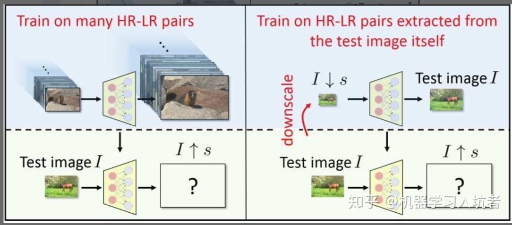

# 该作者写的ZSSR以及InternalGAN,主要贡献：
1. 首先就是在采样方面，通过GAN的思想进行了采样

2. 第二就是开启了无监督方式搭建的CNN超分辨算法

3. 不需要进行预处理，并且计算量很小

4. 没有尺寸限制，可以应用到任何比例的SR任务

从文中的图片可以看出，在ZSSR中训练和测试是同一张图片

```python
print()
```

对于该张图片，使用这张图像进行获得标签图像:
1. 对于测试图像I，对其进行s倍下采样获得ls_down图中的向下箭头，并通过CNN将ls_down重构为l
2. 将测试图片再次放入CNN中，此时将回获得s倍高分辨率图像ls_up(图中向上的箭头)
3. 通过数据增强，下采样不同的倍数，进行不同角度的旋转和水平垂直对称
既然不需要大量的训练数据，也就不需要太复杂的网络结构，ZSSR只包含8个隐藏层，每个隐藏层包含64个通道，使用ReLU作为激活函数。

训练过程中使用Adam优化算法，初始学习率选择为0.001，并使用L1损失。