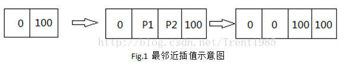
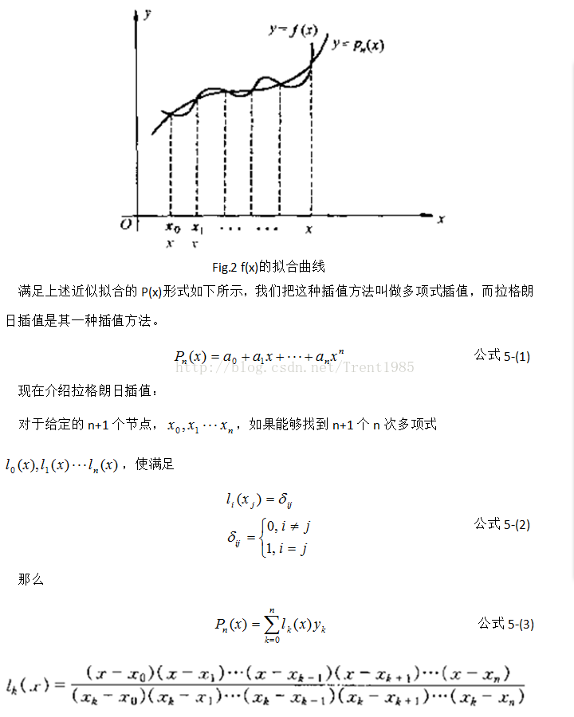
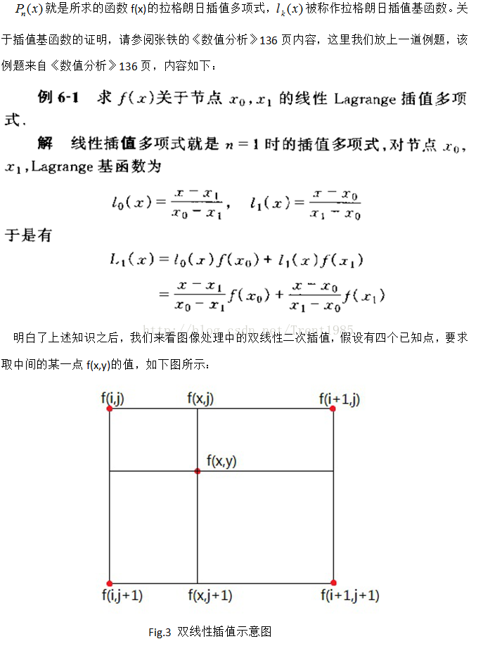
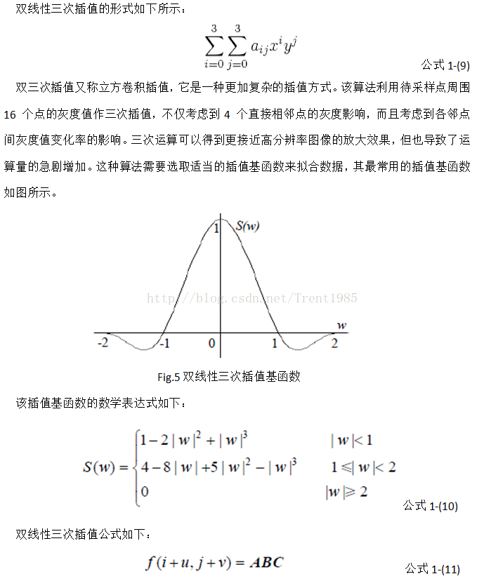
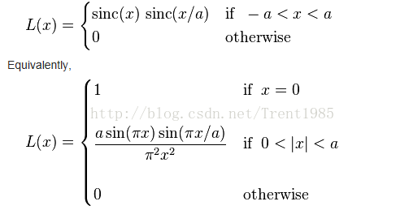
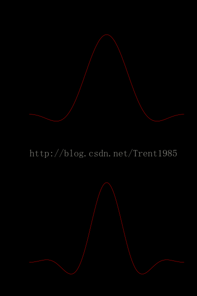
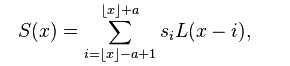
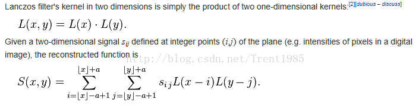

# 今天看论文源码时关于几种插值方式的总结:

## 1.最邻近插值：
注释一下，插入图片，先将你想插入的图片复制到剪切版，然后按ctrl+alt+v就可以将其复制到想复制的地方了

即邻接插值算法，主要原理是让输出像素的像素值等于邻域内离它距离最近的像素值，最简单，但是容易出现锯齿

## 2.双线性二次插值
先介绍下拉格朗日插值多项式

对于一个函数y=f(x)，在区间[a,b]上连续，给定n+1个点，满足a≤x0＜x1……≤b,f(xk)=yk(k=0,1,2,……n)
对于如何寻找一个函数p(x)来近似表示(或逼近)f(x)，可以使用多项式插值，从几何角度看就是将通过n+1个点(xk,yk),k=0,1,2,,,,n的函数作为f(x)的近似。在这个过程中,f(x)被称为被插值函数，p(x)称为插值函数)
 我们的方法是这样的，根据水平方向上的双线性二次插值，由f(I,j)和f(i+1,j)求取f(x,j)，由

f(I,j+1)和f(i+1,j+1)求取f(x,j+1)，然后再根据这两点的二次插值求取f(x,y)。

  根据前面的例题，我们可以很容易的求取各点插值如下：

                        f(x,j)=(i+1-x)f(I,j)+(x-i)f(i+1,j)               公式1-(4)

                      f(x,j+1)=(i+1-x)f(I,j+1)+(x-i)f(i+1,j+1)           公式1-(5)

                       f(x,y)=(i+1-y)f(x,j)+(y-j)f(x,j+1)               公式1-(6)

  以上三式综合可以得到：

  f(x,y)=(j+1-y)(i+1-x)f(I,j)+(j+1-y)(x-i)f(i+1,j)+(y-j)(i+1-x)f(I,j+1)+(y-j)(x-i)f(i+1,j+1)     公式1-(7)

  我们令x=i+p,y=j+q得：

  f(i+p,j+q)=(1-q)(1-p)f(I,j)+p(1-q)f(i+1,j)+q(1-p)f(I,j+1)+pqf(i+1,j+1)                公式1-(8)

  上式即为数字图像处理中的双线性二次插值公式。

## 3.双三次插值

## 4.lanczos插值算法
这也是一个模板算法，主要内容为计算模板中的权重信息
对于一维信息，假如我们输入点集为X，那么，lanczos对应有个窗口模板window，这个窗口中每个位置的权重计算如下：

通常，这个a取2或者3，当a=2时，适用于图像缩小插值，a=3时适用于放大插值，对应不同a的值得Lanczos插值曲线

根据输入点X的位置，确定对应window中不同位置的权重L（x),然后对模板中的点值取加权平均这即为X处的插值结果

推广到二维：

一般情况下，Lanczos插值具有速度快，效果好，性价比最高的优点，这也是目前此算法比较流行的原因。